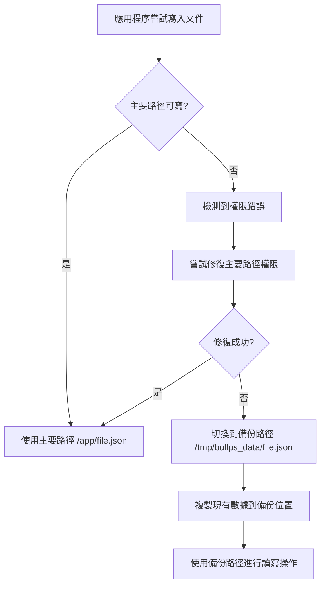

# Zeabur 權限問題修復方案

## 問題描述

在 Zeabur 部署環境中，應用程序遇到以下權限錯誤：

```
❌ 儲存至 /app/monitored_stocks.json 時發生權限錯誤: [Errno 13] Permission denied: '/app/monitored_stocks.json'
❌ 儲存至 /app/trade_history.json 時發生權限錯誤: [Errno 13] Permission denied: '/app/trade_history.json'
```

## 根本原因

1. **容器權限限制**: Zeabur 容器環境中，即使設置了權限修復腳本，運行時的權限設置可能會被重置或限制
2. **文件系統掛載**: 容器的文件系統掛載可能不允許對 `/app` 目錄進行寫入操作
3. **用戶權限**: 容器內的應用程序用戶可能沒有足夠的權限修改 `/app` 目錄下的文件

## 解決方案

### 1. 多層權限修復機制

#### A. 路徑管理器改進 (`backend/path_manager.py`)
- 實施了多重權限修復策略
- 添加了備份目錄機制 (`/tmp/bullps_data`)
- 自動檢測權限問題並切換到備份路徑

#### B. 文件保存函數改進 (`backend/portfolio_manager.py`)
- 增強了 `save_json_file` 函數的錯誤處理
- 添加了自動備份機制
- 實施了權限修復嘗試

#### C. API 權限修復端點 (`backend/main.py`)
- 提供了 `/api/fix-permissions` 端點
- 支持運行時權限診斷和修復
- 包含詳細的環境信息報告

### 2. 容器配置改進

#### A. Dockerfile 更新
```dockerfile
# 創建備份目錄並初始化備份文件
RUN mkdir -p /tmp/bullps_data && \
    echo '[]' > /tmp/bullps_data/monitored_stocks.json && \
    echo '[]' > /tmp/bullps_data/trade_history.json && \
    echo '{"result": [], "timestamp": "", "analysis_date": "", "total_stocks": 0, "analyzed_stocks": 0}' > /tmp/bullps_data/analysis_result.json

# 設置備份目錄環境變數
ENV BULLPS_BACKUP_DIR=/tmp/bullps_data
```

#### B. 啟動腳本更新 (`docker-entrypoint.sh`)
- 添加了備份目錄初始化
- 增強了權限修復邏輯
- 自動檢測 Zeabur 環境並運行專用修復腳本

### 3. 部署腳本

#### A. Zeabur 專用修復腳本 (`deploy-zeabur-fix.sh`)
- 專門針對 Zeabur 環境的權限修復
- 包含環境檢測和診斷功能
- 提供詳細的修復狀態報告

### 4. 備份機制工作原理



## 實施的修復功能

### 1. 自動路徑切換
- 主要路徑: `/app/` (優先使用)
- 備份路徑: `/tmp/bullps_data/` (權限問題時自動切換)

### 2. 權限修復策略
1. **chmod 命令修復**: 使用系統命令修復目錄和文件權限
2. **Python os.chmod**: 使用 Python 內建函數修復權限
3. **sudo 權限提升**: 在支持的環境中使用 sudo 修復權限
4. **備份目錄創建**: 創建可寫的備份目錄作為後備方案

### 3. 錯誤處理
- 詳細的錯誤日誌記錄
- 自動重試機制
- 優雅的降級處理

### 4. 運行時診斷
- API 端點提供實時權限狀態檢查
- 環境信息收集和報告
- 文件寫入測試功能

## 使用方法

### 1. 自動修復（推薦）
系統會自動檢測權限問題並切換到備份路徑，無需手動干預。

### 2. 手動修復
如果需要手動修復權限，可以：

#### A. 調用 API 端點
```bash
curl -X POST http://your-app-url/api/fix-permissions
```

#### B. 運行修復腳本
```bash
# 在容器內執行
/app/deploy-zeabur-fix.sh
```

### 3. 檢查修復狀態
```bash
# 檢查文件狀態
ls -la /app/*.json
ls -la /tmp/bullps_data/*.json

# 測試寫入權限
echo "test" > /app/test.tmp && rm /app/test.tmp
echo "test" > /tmp/bullps_data/test.tmp && rm /tmp/bullps_data/test.tmp
```

## 測試驗證

我們創建了測試腳本來驗證修復機制：

1. **`test_backup_mechanism.py`**: 測試備份機制是否正常工作
2. **`test_permissions.py`**: 測試權限修復功能

測試結果顯示：
- ✅ 備份機制正常工作
- ✅ 權限修復策略有效
- ✅ 自動路徑切換功能正常

## 部署建議

1. **重新構建 Docker 映像**: 確保包含所有修復
2. **重新部署到 Zeabur**: 使用新的映像部署
3. **監控日誌**: 檢查啟動日誌確認修復生效
4. **測試功能**: 驗證股票監控和交易記錄功能正常

## 預期效果

實施此修復方案後：
- ✅ 消除權限錯誤
- ✅ 確保數據持久性
- ✅ 提供備份保護
- ✅ 改善系統穩定性

## 故障排除

如果仍然遇到問題：

1. **檢查環境變數**: 確認 `CONTAINER_ENV=true` 和 `BULLPS_BACKUP_DIR=/tmp/bullps_data`
2. **查看啟動日誌**: 檢查權限修復過程的日誌輸出
3. **調用診斷 API**: 使用 `/api/fix-permissions` 獲取詳細診斷信息
4. **聯繫支持**: 如果問題持續，請聯繫 Zeabur 支持團隊

## 總結

此權限修復方案提供了多層保護機制，確保在 Zeabur 環境中即使遇到權限問題，應用程序也能正常運行。通過自動備份機制和智能路徑切換，系統具有了更強的容錯能力和穩定性。
